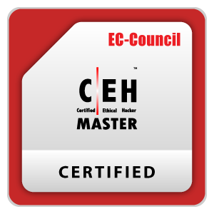
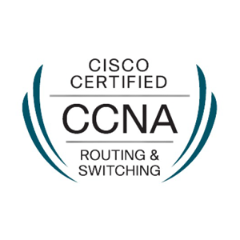

# Greetings! 👋

Hi, I'm **Iven**! I'm a skilled IT professional with over 15 years of experience in
Linux/Windows system administration, cybersecurity, networking (CCNA
certified), and automation (Python, Bash scripting). I have a proven ability to
develop secure, scalable IT infrastructures, troubleshoot complex
systems, and mentor junior staff. I'm passionate about leveraging
technology to improve security, efficiency, and system reliability.

---

## Fields of Knowledge & Interest

### Programming
- Advanced Python (automation, penetration testing)
- SQL for database management and reporting
- Django for web development
- Bash scripting for system tasks and automation in Linux environments

### Security
- **Certified Ethical Hacker (CEH)** certifications
- Penetration testing and vulnerability assessments
- Expertise in security protocols and malware analysis

### Networking
- **CCNA-certified** networking professional
- AWS/GCP setup and VPN services
- DNS/DHCP management and troubleshooting

### Development Tools
- Git for version control
- Docker for containerization and CI/CD workflows

### Operating Systems
- Windows, Linux (Kali, Ubuntu, Red Hat), and MacOS

### Soft Skills
- Coaching and mentoring (ICDL certifications, Python training)
- Project leadership and technical support

---

## Skills Summary

- **Linux Systems Administration**
- **Database Design, Backup, and Migration**
- **Python and Django Development**
- **Cross-Platform Compatibility**
- **Microsoft SQL Administration**
- **Teamwork and Collaboration**
- **Problem-Solving and Multitasking**

---

## Personal Attributes
> _"Driven to innovate and secure the digital future through expertise in programming, cybersecurity, and systems administration. Passionate about collaboration and thrives under pressure."_

---

## Notable Projects

### Cybersecurity Projects
- [Malware Traffic Analysis](https://github.com/iven86/Malware-Traffic-Analysis): In-depth analysis of malware behaviors and network traffic.
- [Meterpreter Traffic Analysis](https://github.com/iven86/Meterpreter-Traffic-Analysis): Penetration testing and payload analysis.
- [SQL Injection Practice](https://github.com/iven86): SQL injection scenarios for testing and learning.

### Development Projects
- [PyEnv Manager](https://github.com/iven86/pyenv): Python environment manager for efficient project development.
- [ROOT_CTF](https://github.com/iven86): Capture-the-Flag challenges for cybersecurity enthusiasts.
- [SQLite MCP Server](https://github.com/iven86/sqlite-mcp-server): A modular Model Context Protocol (MCP) server for SQLite database operations with HTTP API support.

---

## Certifications

---

## Articles and Blog
- 📄 Regularly publishing content on [Iven's Blog](http://www.iven.in/).

---

## Fun Facts
- Favorite IDE: 
- Motivated by the challenge to find and fix bugs: _"Things got bugs, gonna smash them one by one!"_

---

## 🔖 Connect with Me

- **Blog**: [Iven's Blog](http://www.iven.in/)
- **LinkedIn**: 
- **Email**: 

---

## ⚡ Fun Fact

I love working with **Visual Studio Code**:

---

## Technologies I Work With

---

## 🔒 Cybersecurity Projects

## 🚀 Other Projects

---

## 📊 My Statistics

 
 

# Latest blog post
<!-- BLOG-POST-LIST:START -->
<!-- BLOG-POST-LIST:END -->
